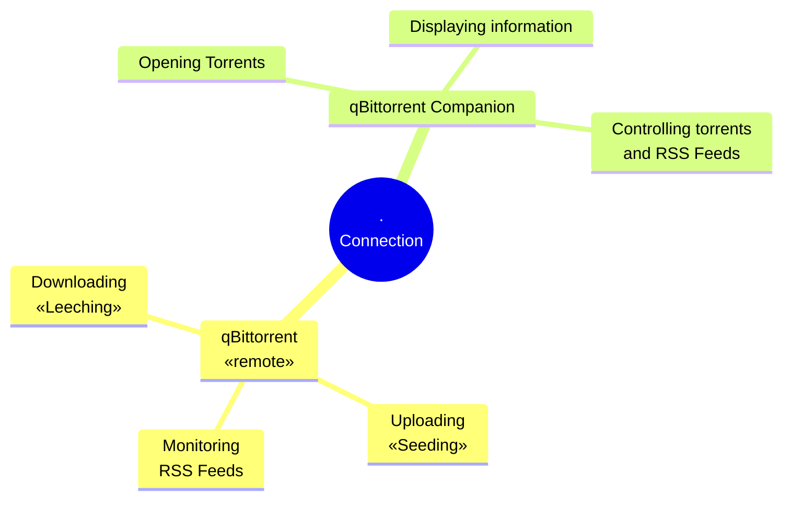

# What is  qBittorrent Companion?
qBittorrent Companion is an alternative to the WebUI [qBittorrent](https://www.qbittorrent.org/) comes with that requires a browser. 
qBittorrent Companion takes a different approach and is dedicated application*,  this has some advantages:

* Launch downloaded files directly from qBittorrent Companion
* Set it as the default app to handle `.torrent` files 
* Enjoy a modern (dark-themed) UI

>[!NOTE]
> *Dedicated means it runs on your local system. However, it still needs to connect to a system running qBittorrent with the WebUI enabled.

> [!CAUTION]
> This is an early alpha release. Expect bugs and some UI issues.

## How to use
**Short version:** Grab [the executable](https://github.com/Axeia/qBittorrentCompanion/releases/), unzip it, run it.

**Long Version:**
1. Install qBittorrent on your 'server' PC. qBittorrent Companion requires logging into a qBittorrent WebUI.
2. Set up qBittorrent and enable the WebUI. Test it on the server by visiting http://127.0.0.1:8080 (default port is 8080; adjust the URL if you changed the port).
If it works, try accessing http://your.server.ip.address:8080 from the device you intend to run qBittorrent Companion on.
3. Download the most recent release of qBittorrent Companion. Newer versions are recommended.
Unzip it to your desired location (no installer available yet).
4. Run qBittorrentCompanion.desktop.exe.
>[!NOTE]
> Make sure your firewall if you're using one is forwarding the relevant port (8080 by default, but customizable in qBittorrents settings)



## Implemented vs To Implement
### Implemented 
Current functionality that *should* work:
* **Transfers Tab**
	* Adding torrents via link, file, or 'open with' in the file explorer
	* Open files/folders directly from qBittorrent Companion (configure Download/Temporary folders first)
	* Display & manage torrents (pause/resume/delete).
	* Filter torrents (by text or status)
	* Selected Torrent information - *Displaying fine but changing any properties isn't implemented yet*
		* General 
		* Trackers
		* Peers - *Displaying mostly fine, although a default flag icon might be used a bit too often.*
		* HTTP Sources 
		* Content 
	* Manage categories & tags
* **RSS Tab**
	* **RSS Feeds**
		* Manage RSS feeds
	* **RSS Rules**
		* Manage rules
		* **Matches**
			* Regular expressions are applied although using C#'s logic rather than PERL as qBittorrent would use. This might get changed at some point if it proves problematic
			* Wildcards not implemented exactly like qBittorrent due to Qt framework specifics.
		* **Test Data**
			* Doesn't work yet
* Search Tab (everything besides editing search plugins)

### Not implemented
* Anything accessed through the menus
* Anything other than ⊞ Windows support, I'll probably look into creating an Android and 🐧Linux version. 
Although Mac and iOS should be possible I don't know how feasible it is for me to do so,  I don't own any devices running either OS.

### New functionalities
Some things I think that can make this better than the WebUI:
#### Implemented
* Live preview of RSS Rules
* Configure where the Download/Temporary folders are located from the device qBittorrent Companion runs on (probably a network share) and you can then open torrent contents.

#### Not implemented
* Testing RSS Rules on test data as RSS feeds might not contain what you want to test on at that moment (partially implemented but non-functional)
* Monitoring a local folder for .torrent files to automatically start downloading


## Some rambling about the development
Everything below is aimed more at developers wondering why some things are the way they are and is not aimed at regular users (unless you're just super curious).
### Oddities
There might still be some code lingering around from a very early version where I wrote my own API code, then I found the qBittorrent-net-client project and it was almost a drop in replacement (a couple of small name changes mostly).

Torrent Content uses a TreeDataGrid and it has some weird glitches (the Avalonia documentation does state this component is in development / considered a beta). I've noticed the file size for folders (which are calculated dynamically by summing up the size of the contents in it) can change when you scroll up and down in the Tree.
<hr/>

Other oddities would likely be to this being my first C# project in quite some time and might get worked out over time.


## Dependencies
This project uses the following NuGet packages:
* Avalonia
* Avalonia.Diagnostics
* Avalonia.Fonts.Inter
* Avalonia.ReactiveUI
	* I've used it where it makes sense - ViewModels that are simply (or at least mostly) wrappers around a really simple model use dot net's own `PropertyChangedEventHandler`.
* Avalonia.Themes.Fluent
* Avalonia.Controls.DataGrid
* Avalonia.Controls.TreeDataGrid
* Avalonia.Desktop
* QBittorrent.Client
	* Newtonsoft.Json (used by qBittorrent.Client for handling API requests, but this project uses it to store settings as well)

## Build command
Desktop build for windows:<br/>
```dotnet publish -p:PublishSingleFile=true -c Release -r win-x64 --self-contained```

## License
This project is released under the MIT license by Pascal Bakhuis.

## Credit
* qBittorrent Companion: Pascal Bakhuis 
* QBittorrent.Client: [fedarovich](https://github.com/fedarovich/qbittorrent-net-client)
* UI:  [Avalonia](https://avaloniaui.net/) (and [fluent icons](https://github.com/davidxuang/FluentIcons))
* Flag icons: [flagpedia.net](https://flagpedia.net/) (displayed in the `Peers` tab when selecting a torrent)

And of course [qBittorrent(.org)](https://www.qbittorrent.org/) itself. 